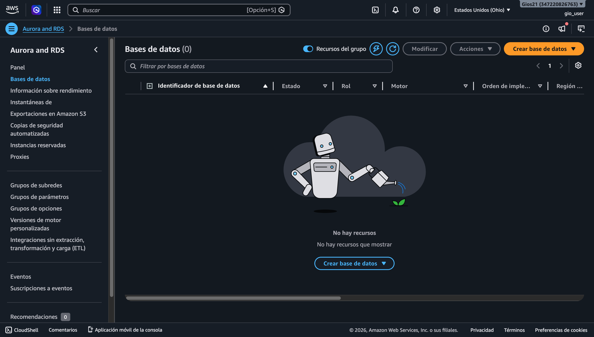
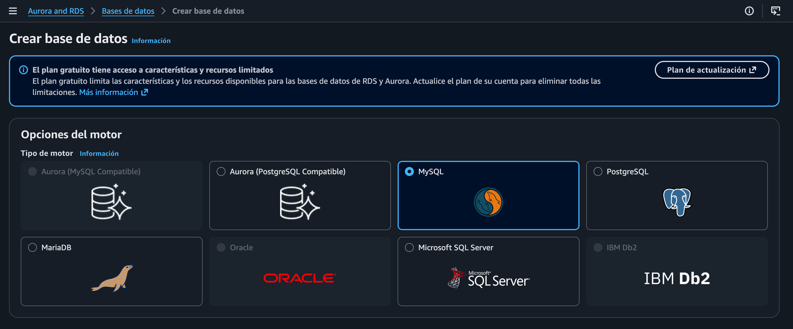

# MANUAL TÉCNICO DEL PROYECTO

## 1. Introducción

El presente documento describe la arquitectura, configuración e implementación de una aplicación web desplegada en la nube utilizando servicios de AWS. El sistema permite el registro, autenticación, interacción social entre usuarios y procesamiento de imágenes, integrando múltiples servicios administrados para garantizar escalabilidad, disponibilidad y seguridad.

La solución implementa una arquitectura distribuida basada en instancias EC2 detrás de un balanceador de carga, almacenamiento en S3, base de datos relacional en RDS, autenticación mediante Cognito y procesamiento mediante servicios como Rekognition, Translate y Lambda.

---

## 2. Objetivos

### 2.1 Objetivo General

Desarrollar e implementar una aplicación web escalable utilizando servicios de AWS que permita la interacción social entre usuarios con autenticación segura y procesamiento de imágenes.

### 2.2 Objetivos Específicos

* Configurar infraestructura en la nube utilizando instancias EC2.
* Implementar autenticación mediante Cognito.
* Almacenar datos estructurados en RDS (MySQL).
* Gestionar imágenes mediante S3 y Lambda.
* Integrar servicios de inteligencia artificial como Rekognition y Translate.
* Configurar balanceo de carga para alta disponibilidad.

---

## 3. Arquitectura del Sistema

La arquitectura del sistema está compuesta por los siguientes componentes:

* Frontend: Aplicación web alojada en S3 (hosting estático).
* Backend: Servidor en EC2 (Node.js o Python).
* Balanceador: Application Load Balancer (ELB).
* Base de datos: RDS MySQL.
* Almacenamiento: S3.
* Autenticación: Cognito.
* Procesamiento: Lambda + API Gateway.
* IA: Rekognition y Translate.
* Chatbot: Lex.

---

## 4. Configuración Inicial en AWS

### 4.1 Creación de Usuarios IAM

1. Acceder al servicio IAM.
2. Crear usuarios administrativos y técnicos.
3. Asignar permisos mediante políticas:

   * Acceso a EC2
   * Acceso a S3
   * Acceso a RDS
   * Acceso a Lambda
   * Acceso a API Gateway

 00.48.41.png>)

4. Crear roles para:

   * EC2 (acceso a S3, Rekognition, etc.)
   * Lambda (acceso a S3)

 01.08.34.png>)   


 13.35.02.png>)

---

## 5. Configuración de la Base de Datos (Amazon RDS - MySQL)

### 5.1 Creación de la Instancia

1. Ingresar a RDS.


2. Seleccionar "Crear base de datos".

3. Elegir:

   * Motor: MySQL
   * Plantilla: Free Tier (si aplica)

   

4. Configuración:

   * DB Instance Identifier: nombre único
   * Usuario maestro: admin
   * Contraseña: segura

 15.17.02.png>)

### 5.2 Configuración de Red

* Seleccionar VPC por defecto o personalizada.
* Habilitar acceso público (solo si es necesario).
* Configurar Security Group:

  * Permitir puerto 3306 (MySQL)
  * Restringir acceso solo a EC2

### 5.3 Creación de la Base de Datos

Una vez creada la instancia:

1. Conectarse mediante cliente MySQL.
2. Crear base de datos:

```sql
CREATE DATABASE proyecto;
USE proyecto;
```

### 5.4 Estructura Base Recomendada

Tablas principales:

* usuarios
* publicaciones
* comentarios
* amigos
* solicitudes_amistad

Ejemplo básico:

```sql
CREATE TABLE usuarios (
    id INT AUTO_INCREMENT PRIMARY KEY,
    nombre VARCHAR(255),
    correo VARCHAR(255) UNIQUE,
    dpi VARCHAR(50),
    foto_perfil TEXT,
    cognito_id VARCHAR(255)
);
```

---

## 6. Configuración de Almacenamiento (Amazon S3)

### 6.1 Creación del Bucket de Imágenes

1. Crear bucket con nombre:

   * semi1proyecto-g#
2. Configuración:

   * Acceso público controlado
   * Versionado opcional

### 6.2 Bucket para Sitio Web

1. Crear bucket:

   * Proyecto-Web-G#
2. Habilitar:

   * Static Website Hosting

 15.18.31.png>)
3. Subir archivos del frontend
4. Configurar permisos públicos de lectura
 15.19.09.png>)

---

## 7. Configuración de EC2

### 7.1 Creación de Instancias

1. Crear 2 instancias EC2.
2. Configuración:

   * Sistema operativo: Ubuntu
   * Tipo: t2.micro (si aplica)

 15.20.04.png>)
3. Instalar:

   * Node.js o Python
   * Dependencias del backend


### 7.2 Clonación

* Ambas instancias deben tener:

  * Mismo código
  * Misma configuración
  * Mismos endpoints

### 7.3 Seguridad

* Configurar Security Groups:

  * Puerto 80 (HTTP)
  * Puerto 22 (SSH)
  * Permitir tráfico desde ELB

   15.20.56.png>)

    * security groups
   15.21.32.png>)

    * para el balanceador
     15.22.23.png>)

---

## 8. Configuración del Balanceador (ELB)

1. Crear Application Load Balancer.

 15.23.01.png>)

2. Configurar:

   * Listener HTTP (puerto 80)
     15.22.23.png>)

   * agentes de escucha y reglas
    15.23.42.png>)

2.2. Target.
 15.35.08.png>)

3. Registrar instancias EC2.
4. Configurar Health Check:

   * Endpoint: /health o similar

    15.37.19.png>)

---

## 9. Configuración de API Gateway y Lambda

### 9.1 Función Lambda

* Función encargada de:

  * Recibir imagen
  * Procesarla
  * Subirla a S3

``` js
const { S3Client, PutObjectCommand } = require("@aws-sdk/client-s3");

const s3 = new S3Client({ region: "us-east-2" });

exports.handler = async (event) => {
  try {
    console.log("EVENT:", event);

    const body = event.body ? JSON.parse(event.body) : event;

    const { image, filename, contentType } = body;

    if (!image) {
      throw new Error("No se recibió imagen");
    }

    const buffer = Buffer.from(image, "base64");

    const key = `foto-perfil/${Date.now()}-${filename}`;

    const command = new PutObjectCommand({
      Bucket: "semi1proyecto-1s26-g8",
      Key: key,
      Body: buffer,
      ContentType: contentType,
    });

    await s3.send(command);

    const url = `https://semi1proyecto-1s26-g8.s3.us-east-2.amazonaws.com/${key}`;
    return {
      statusCode: 200,
      body: JSON.stringify({
        ok: true,
        url,
        key,
      }),
    };

  } catch (error) {
    console.error("ERROR LAMBDA:", error);

    return {
      statusCode: 500,
      body: JSON.stringify({
        ok: false,
        mensaje: error.message,
      }),
    };
  }
};
```

   15.38.44.png>)

### 9.2 API Gateway

1. Crear API REST.

 15.41.59.png>)

2. Crear endpoint:
   * POST /upload

 15.42.41.png>)

3. Integrar con Lambda.
 15.40.12.png>)

---

## 10. Configuración de Cognito

### 10.1 User Pool

1. Crear User Pool.
 16.02.27.png>)

2. Configurar atributos:

   * Nombre
   * Correo
   * DPI

    16.03.16.png>)

### 10.2 Autenticación

* Habilitar login con:

  * Usuario y contraseña

   16.07.07.png>)

* Activar verificación por correo.
 16.04.01.png>)
---

## 11. Configuración de Rekognition

* Usos:

  * Detección de etiquetas en imágenes.
     16.10.13.png>)

  * Reconocimiento facial.
   16.08.42.png>)

Flujo:

1. Imagen subida a S3.
2. Lambda procesa imagen.
3. Rekognition devuelve etiquetas.

 16.11.25.png>)

---

## 12. Configuración de Translate

* Permite traducción de:

  * Publicaciones
  * Comentarios

Idiomas sugeridos:

* Inglés
* Francés
* Portugués

---

## 13. Configuración de Chatbot (Lex)

1. Crear bot.
 16.17.05.png>)


 16.17.44.png>)

2. Definir intents:

   * Preguntas frecuentes

 16.18.31.png>)

3. Integrar con Lambda (opcional).

---

## 14. Seguridad

* Uso de IAM Roles.
* Restricción de puertos.
* Control de acceso a S3.
* Uso de HTTPS (opcional con certificados).
 16.23.51.png>)

---

## 15. Pruebas y Validación

* Verificar:

  * Registro de usuarios
  * Login
  * Subida de imágenes
  * Balanceo de carga
  * Conexión a base de datos

---

## 16. Conclusión

El sistema implementado demuestra el uso integrado de múltiples servicios de AWS para construir una solución escalable, segura y distribuida, cumpliendo con los requerimientos establecidos.
