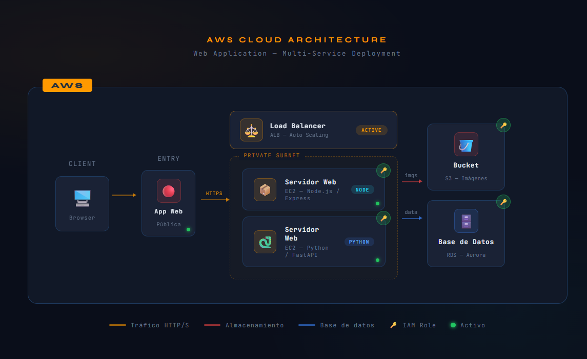
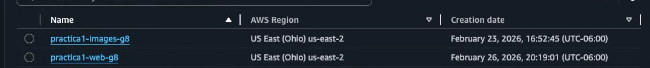
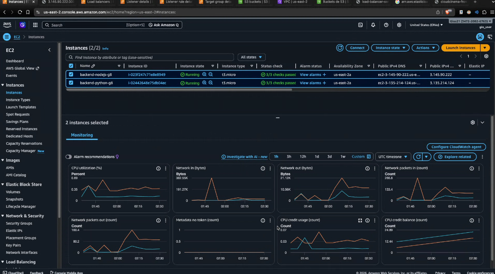
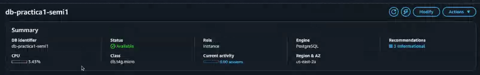
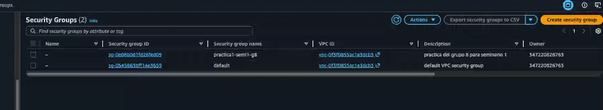
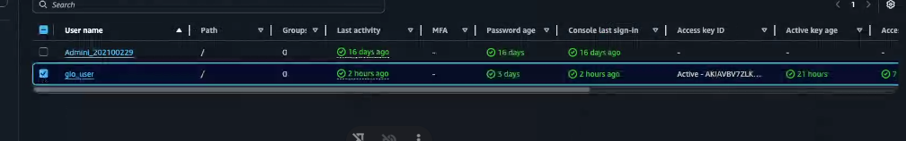
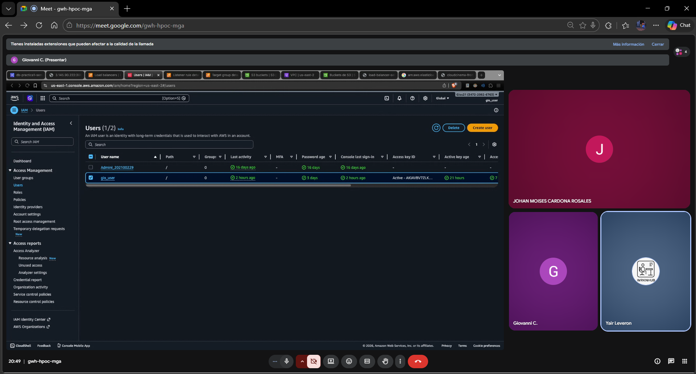

# SEMINARIO1_A_1S2026_G8

# CloudCinema -- Práctica 1

Seminario de Sistemas 1 -- 1S2026 Universidad de San Carlos de Guatemala

------------------------------------------------------------------------

## 1. Datos de los Estudiantes

  Nombre Completo                   Carné         Rol en el Proyecto
  -----------------                 ----------  -----------------------
  Johan Moises Cardona Rosales      202201405   Backend Node.js, AWS Config
  Giovanni Saul Concoha Cax         202100229   Backend Python,   AWS Config
  Estiben Yair Lopez Leveron        202204578   Frontend, Base de Datos & IAM

Grupo: G8\
Repositorio: SEMINARIO1_A\_1S2026_G#

------------------------------------------------------------------------

# 2. Descripción de la Arquitectura Utilizada

Se implementó una arquitectura distribuida en AWS con alta
disponibilidad utilizando:

-   IAM
-   EC2 (2 instancias)
-   Application Load Balancer
-   S3
-   Amazon RDS
-   Security Groups

------------------------------------------------------------------------

## Arquitectura General

Usuario → S3 (Frontend estático)\
Frontend → Load Balancer (DNS público)\
Load Balancer → EC2 Node.js\
Load Balancer → EC2 Python\
Ambas EC2 → Amazon RDS\
Ambas EC2 → S3 (Imágenes)

------------------------------------------------------------------------

## Componentes Implementados

### Amazon S3

Se crearon dos buckets:

-   Practica1-Web-G#8
    -   Hosting web estático
    -   Contiene archivos HTML, CSS y JS del frontend
-   Practica1-Images-G8
    -   Carpeta Fotos_Perfil/
    -   Carpeta Fotos_Peliculas/
    -   Permisos públicos con política s3:GetObject

Las imágenes no se almacenan en la base de datos, únicamente se guarda
la ruta: 

------------------------------------------------------------------------

### Instancias EC2

Se configuraron dos instancias:

  Instancia                  Tecnología          Puerto
  ------------            -------------------    --------
  EC2-Backend-nodejs-g8    Node.js + Express      3000
  EC2-Backend-python-g8   Python + Flask          5000

Ambas instancias:

-   Utilizan AWS SDK
-   Se conectan a la misma base de datos RDS
-   Exponen los mismos endpoints:
    -   /auth
    -   /user
    -   /movies
    -   /playlist
    -   /health

------------------------------------------------------------------------

### Application Load Balancer

-   Tipo: Application Load Balancer
-   Target Group con ambas instancias
-   Distribución equitativa del tráfico
-   Prueba de alta disponibilidad:
    -   Al apagar una instancia, el sistema sigue funcionando
        correctamente

    

------------------------------------------------------------------------

### Amazon RDS

Motor utilizado: PostgreSQL

Base de datos relacional externa.

Tablas principales:

-   usuarios
-   peliculas
-   lista_reproduccion

Características:

-   Contraseñas almacenadas con MD5
-   No se almacenan imágenes binarias
-   Solo URLs públicas de S3

------------------------------------------------------------------------

### Security Groups

Configuración aplicada:

EC2: - Puerto 80 (HTTP) - Puerto 3000 - SSH (solo IP autorizada)

------------------------------------------------------------------------

# 3. Usuario IAM y Políticas Utilizadas

En esta práctica se utilizó un único usuario IAM para la administración de todos los servicios AWS requeridos en la arquitectura de CloudCinema.

## Usuario IAM Utilizado

**Nombre del usuario:** `gio_user`

Este usuario fue utilizado para:

- Creación y configuración de instancias EC2  
- Configuración de Security Groups  
- Creación y administración del Application Load Balancer  
- Creación y configuración de la base de datos en RDS  
- Gestión de buckets S3  
- Generación de Access Keys para la conexión del backend con AWS (boto3)

---

## Políticas Asociadas

El usuario cuenta con permisos amplios para permitir la correcta configuración de la infraestructura.

Políticas asignadas:

- `AmazonEC2FullAccess`
- `AmazonS3FullAccess`
- `AmazonRDSFullAccess`
- `ElasticLoadBalancingFullAccess`

Estos permisos permitieron administrar los siguientes servicios:

- EC2  
- S3  
- RDS  
- Elastic Load Balancer  

---

## Justificación Técnica

Aunque el enunciado recomienda la separación de responsabilidades mediante múltiples usuarios IAM, en esta implementación se utilizó un único usuario debido a:

- Simplificación de la configuración durante el desarrollo.
- Centralización de credenciales para la administración inicial.
- Control de acceso reforzado mediante Security Groups.

En un entorno productivo real se recomienda:

- Implementar separación de responsabilidades.
- Aplicar el principio de menor privilegio.
- Utilizar IAM Roles asociadas a las instancias EC2 en lugar de Access Keys.
------------------------------------------------------------------------

nos reunimos a realizar las configuraciones en amazon en un meet por eso solo utilizamos un iam
------------------------------------------------------------------------

# 5. Pruebas Realizadas

-   Registro con correo único
-   Encriptación MD5
-   Subida de imágenes a S3
-   Alta disponibilidad apagando una EC2
-   Balanceo de tráfico
-   Conexión correcta a RDS
-   Gestión de lista de reproducción

------------------------------------------------------------------------

# 6. Conclusiones

Se logró implementar una arquitectura distribuida en AWS con:

-   Alta disponibilidad
-   Separación de responsabilidades con IAM
-   Balanceo de carga funcional
-   Almacenamiento externo de imágenes
-   Base de datos relacional en la nube
-   Aplicación completamente desplegada en AWS
